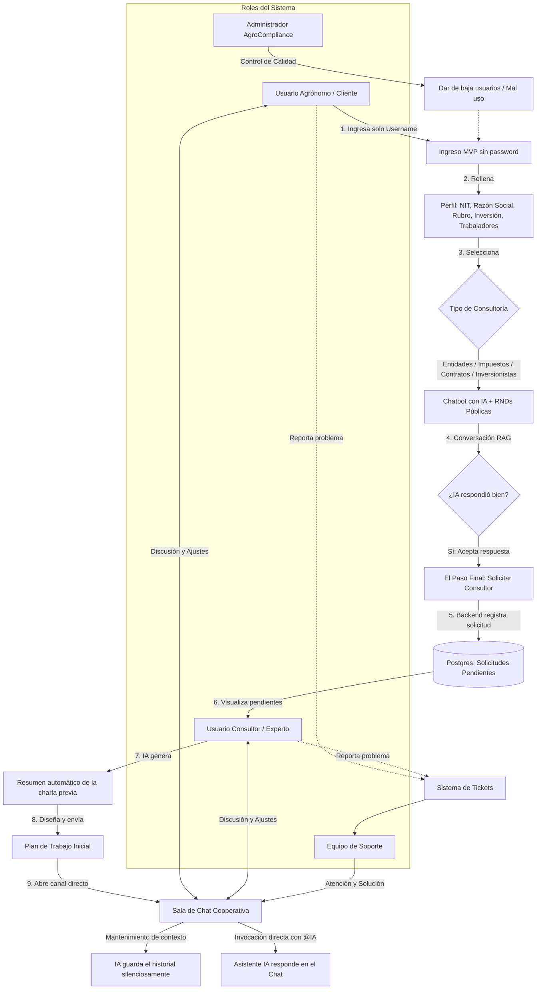

# 🌱 AgroCompliance MVP - Guía de Despliegue

AgroCompliance es una plataforma tecnológica orientada al sector agrícola para automatizar la gestión legal, contable y de contingencias, previniendo multas y optimizando recursos operativos.

Esta guía está diseñada para que cualquier desarrollador pueda levantar la infraestructura completa del MVP desde cero, utilizando Docker Compose.

---

## 🏗️ Arquitectura del Sistema

La plataforma está contenerizada y se divide en 4 servicios principales orquestados por Docker:
1.  **Frontend:** Interfaz de usuario construida en React.
2.  **Backend:** API REST en Java 17 (Spring Boot).
3.  **Automatizador (Core):** n8n para flujos de trabajo legales y alertas.
4.  **Proxy Inverso:** Nginx (Maneja el enrutamiento HTTP y servirá HTTPS a futuro).
5.  **Base de Datos:** PostgreSQL 15.

---

## 📋 Fase 1: Requisitos Previos y Servidor (AWS EC2 - Amazon Linux 2023)

Si estás instalando esto en un servidor en la nube de AWS con **Amazon Linux 2023 (AL2023)**, sigue estos pasos exactos antes de tocar el código.

### 1.1 Configuración de Puertos (Security Groups)
El servidor **debe** tener abiertos los siguientes puertos hacia internet (`0.0.0.0/0`) en sus reglas de entrada:
* **Puerto 22 (SSH):** Para tu acceso remoto.
* **Puerto 80 (HTTP):** Para el acceso a la plataforma (MVP) y validación de Certbot.
* **Puerto 443 (HTTPS):** Para el futuro pase a producción segura.

### 1.2 Instalación de Docker y Permisos (Específico para AL2023)
Amazon Linux 2023 utiliza el gestor de paquetes `dnf`. Para evitar errores de permisos (tener que usar `sudo` para todo) y habilitar la construcción moderna de imágenes, ejecuta lo siguiente:

```bash
# 1. Actualizar el sistema e instalar Docker
sudo dnf update -y
sudo dnf install docker -y
sudo systemctl start docker
sudo systemctl enable docker

# 2. Agregar el usuario predeterminado de EC2 al grupo Docker
sudo usermod -aG docker ec2-user

# ⚠️ IMPORTANTE: Cierra tu sesión SSH y vuelve a entrar para que el cambio de permisos surta efecto.

# 3. Instalar el plugin Buildx (Requerido para comandos como `docker compose up --build`)
mkdir -p ~/.docker/cli-plugins/
curl -L [https://github.com/docker/buildx/releases/download/v0.17.1/buildx-v0.17.1.linux-amd64](https://github.com/docker/buildx/releases/download/v0.17.1/buildx-v0.17.1.linux-amd64) -o ~/.docker/cli-plugins/docker-buildx
chmod +x ~/.docker/cli-plugins/docker-buildx

# 4. Verificar que la instalación de Docker Compose funciona:
docker compose version

```

# 5. Es necesario un archivo para la configuracion del proyecto el archivo se debe crear con el nombre .env y debe tener la siguiente configuracion


```bash
# ─── BASE DE DATOS ──────────────────────────
POSTGRES_DB=agrocompliance_db
POSTGRES_USER=tu_usuario_seguro
POSTGRES_PASSWORD=tu_password_seguro

# ─── CONFIGURACIÓN GENERAL ──────────────────
# Reemplaza por la IP pública del servidor o tu dominio (ej. 54.81.75.219 o app.empresa.com)
DOMAIN_NAME=TU_IP_O_DOMINIO
TIMEZONE=America/La_Paz

```


#Fase 2: Flujo del proyecto


Los PeCausas IA Edition

Jorge Medellin
Gabriel Bodomir
Sergio Cruz
Xavier Vaca
Joaquin Caballero
Freddy Leon